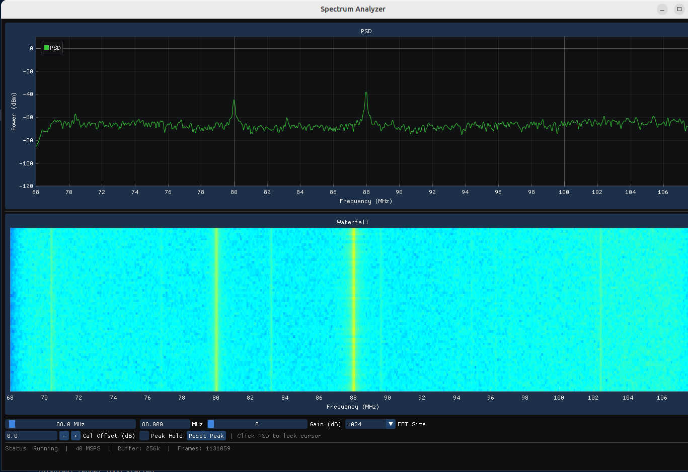
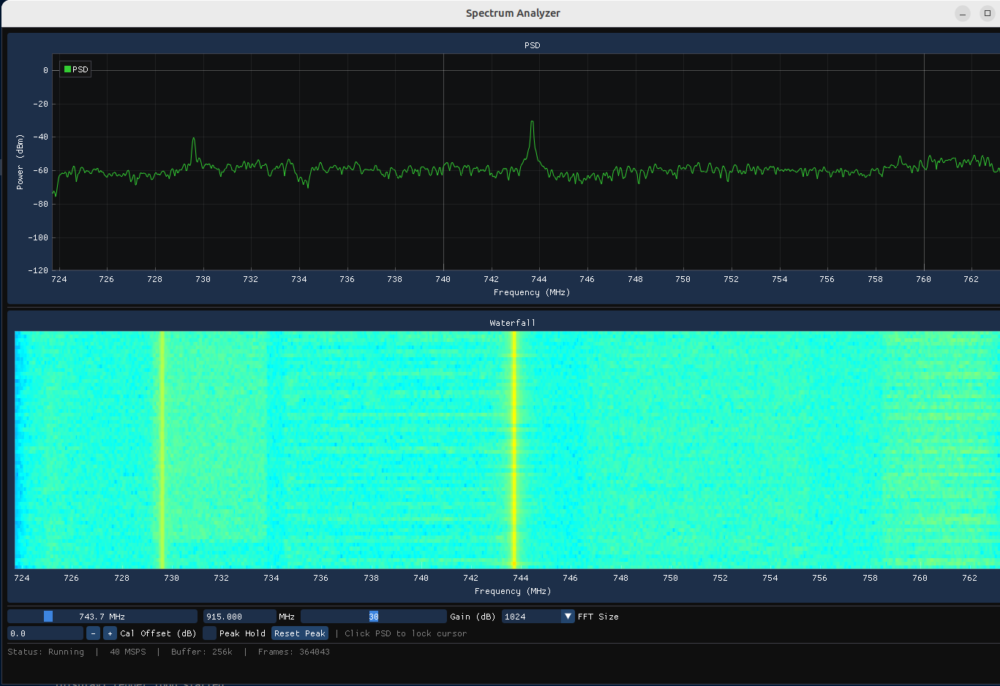
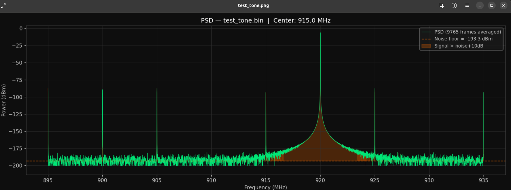
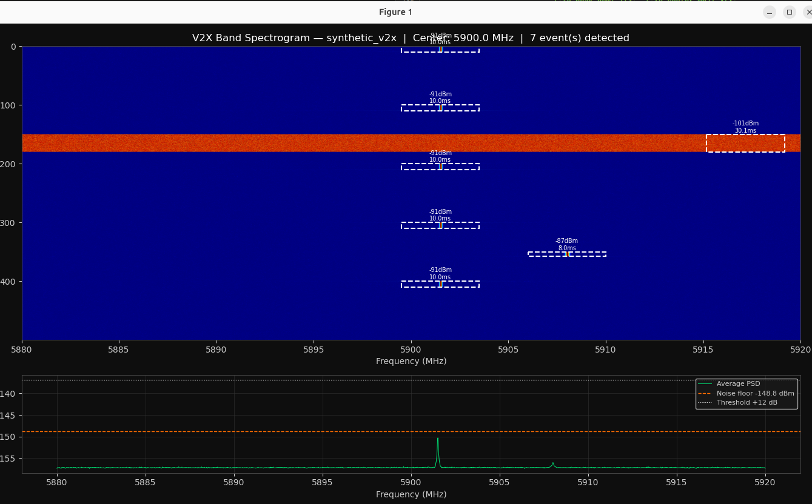

# Spectrum Analyzer
 
This project exists because of a $300 mistake. While building a 4G LTE network on a BladeRF using srsRAN, corrupted packets from the radio cost five weeks of debugging with no clear path to the root cause. The problem was simple in hindsight — there was no way to verify the RF environment before sending signals into it. No clean frequency, no communication. This is the unsexy work that underpins everything in radio frequency engineering.
 
The fix was a spectrum analyzer. Before transmitting anything, you need to see the full picture — where the spectrum is clean, where it's noisy, and where interference is already living. A waterfall and PSD plot gives you that. Consistent coloration means clean signal. Discoloration and noise means something is wrong before a single packet leaves the radio.
 
Built on a BladeRF 2.0 Micro xA4, streaming 40 MSPS through a lock-free producer/consumer pipeline in C++17, with Hann windowing, FFTW3 transforms, and Welch averaging for a stable noise floor. Live PSD and scrolling waterfall rendered via Dear ImGui and ImPlot. Covers 50 MHz to 6 GHz. Includes Python scripts for offline IQ analysis and V2X band interference characterization.
 
---


## Screenshots

**FM Band (88–108 MHz) — each spike is a distinct FM station. Persistent carriers 
with stable amplitude confirm clean reception. This is what a known-good signal 
looks like on the waterfall — used as a sanity check before tuning to a working frequency.**


**743 MHz — two narrowband carriers visible as persistent vertical lines on the 
waterfall. Unidentified persistent carriers like these are exactly what you want 
to find before transmitting — they tell you the band is occupied before you 
waste time debugging a collision.**


**Python PSD Plot — synthetic two-tone test at 920 MHz with noise floor overlay. 
The gap between the signal peak and the noise floor is the SNR. Used offline to 
validate the dBm calibration math against known input power.**


**Python V2X Spectrogram — synthetic interference burst characterization at 5.9 GHz. 
The C-V2X band sits here. Horizontal axis is time, vertical is frequency — the 
bright horizontal streaks are interference events. This analysis script was built 
to characterize the RF environment before any V2X transmission.**


---

## What It Does

- Streams raw 16-bit IQ samples from the BladeRF at 40 MSPS over USB 3.0
- Scales samples to normalized complex floats and pushes into a lock-free circular ring buffer
- Processing thread pulls batches, applies a Hann window, runs an FFTW3 forward transform, and accumulates magnitude-squared output using Welch's method across 8 frames
- Converts averaged power to dBm via `10 * log10(|X[k]|² / N²) + cal_offset`, applies fftshift to center DC, and interpolates the DC bin to suppress the hardware offset artifact
- Display thread renders a live PSD line graph and scrolling waterfall heatmap at vsync via Dear ImGui and ImPlot
- User controls: center frequency (50–6000 MHz), gain (0–60 dB), FFT size (1024/2048/4096), calibration offset, peak hold, cursor dBm readout, IQ save

---

## Hardware

| Component | Detail |
|-----------|--------|
| SDR | Nuand BladeRF 2.0 Micro xA4 |
| RFIC | Analog Devices AD9361 |
| Frequency range | 50 MHz – 6 GHz |
| Sample rate | 40 MSPS (USB 3.0 required) |
| Interface | USB 3.0 SuperSpeed |
| Firmware | v2.6.0 |
| FPGA | v0.15.3 hostedxA4 |

---

## Dependencies

```bash
# System
sudo apt install libbladerf-dev libfftw3-dev libglfw3-dev libgl1-mesa-dev

# ImGui and ImPlot (source build)
git clone https://github.com/ocornut/imgui third_party/imgui
git clone https://github.com/epezent/implot third_party/implot

# Python
sudo apt install python3-numpy python3-matplotlib
```

---

## Build

```bash
mkdir build && cd build
cmake .. -DCMAKE_BUILD_TYPE=Release
make -j$(nproc)
```

Debug build with AddressSanitizer:
```bash
cmake .. -DCMAKE_BUILD_TYPE=Debug -DSANITIZE=address
```

Debug build with ThreadSanitizer:
```bash
cmake .. -DCMAKE_BUILD_TYPE=Debug -DSANITIZE=thread
```

---

## Run

```bash
# plug in BladeRF, then:
./spectrum_analyzer
```

The display opens immediately. The capture thread will print `[capture] BladeRF opened` and `[capture] streaming` once the device initializes. If the FPGA is not loaded:

```bash
wget https://www.nuand.com/fpga/v0.15.3/hostedxA4.rbf
bladeRF-cli -l hostedxA4.rbf
```

---

## Python Scripts

Generate synthetic test data and analyze offline IQ captures. Synthetic generation in order to bypass hardware artifact error

**PSD analysis:**
```bash
cd python

# generate a synthetic two-tone test file
python3 psd_generate.py --out test.bin --freq1 5 --freq2 -8

# plot PSD with noise floor overlay
python3 psd_plot.py test.bin --freq 915 --rate 40

# analyze a real BladeRF capture
python3 psd_plot.py ../data/iq_20260526_143022_88MHz.bin --freq 88
```

**V2X interference analysis:**
```bash
# generate synthetic V2X band data with interference events
python3 v2x_generate.py --out test_v2x.bin --events 3

# characterize interference events — outputs spectrogram + CSV event log
python3 v2x_analysis.py test_v2x.bin --freq 5900

# analyze a real 5.9 GHz capture
python3 v2x_analysis.py ../data/iq_20260526_143500_5900MHz.bin --freq 5900
```

---

## Known Hardware Artifact — DC Offset Spike

A spike at the center frequency is a known characteristic of direct conversion receivers. On the BladeRF 2.0 Micro, the AD9361 RFIC handles DC calibration internally during initialization — the manual `cal dc rx` CLI command is for the older bladeRF hardware only and will fail on the Micro.

Two mitigations are applied in software:
- `bladerf_set_correction()` called at startup to zero I/Q DC bias
- Center FFT bin interpolated from its neighbors after each transform

Residual offset may still appear at high gain settings. It is not a real signal.

---

## Project Structure

```
spectrum_analyzer/
├── include/
│   ├── app_state.hpp        # shared state between all threads
│   ├── circular_buffer.hpp  # lock-free SPSC ring buffer
│   ├── capture.hpp          # BladeRF capture thread
│   ├── processing.hpp       # FFT/Welch processing thread
│   └── display.hpp          # ImGui/ImPlot display thread
├── src/
│   ├── main.cpp             # thread launch and shutdown
│   ├── circular_buffer.cpp
│   ├── capture.cpp
│   ├── processing.cpp
│   └── display.cpp
├── python/
│   ├── psd_plot.py          # offline PSD analysis
│   ├── psd_generate.py      # synthetic PSD test data
│   ├── v2x_analysis.py      # V2X interference characterization
│   └── v2x_generate.py      # synthetic V2X test data
├── data/                    # IQ captures saved here (gitignored)
└── third_party/
    ├── imgui/
    └── implot/
```

---

## Tools and Libraries

| Tool | Purpose |
|------|---------|
| libbladeRF 2.5.0 | Hardware abstraction for BladeRF 2.0 Micro |
| FFTW3 (float) | Fast Fourier Transform engine |
| Dear ImGui | Immediate mode GUI framework |
| ImPlot | GPU-accelerated plotting for ImGui |
| GLFW + OpenGL 3.3 | Window and rendering backend |
| NumPy / Matplotlib | Offline IQ analysis and visualization |

---

## Signals Observed

| Band | Frequency | What Was Seen |
|------|-----------|---------------|
| FM Radio | 88–108 MHz | Persistent carriers at each local station |
| ISM | 868 MHz | LoRa/smart meter burst activity |
| ISM | 915 MHz | Intermittent burst transmissions |
| WiFi | 2.4 GHz | Continuous activity, wide carrier |
| V2X / 5 GHz WiFi | 5900 MHz | Signal activity observed in the 5.9 GHz band |

---

## References

- [Nuand BladeRF 2.0 Micro Documentation](https://www.nuand.com/bladeRF-2.0-micro/)
- [libbladeRF API Reference](https://www.nuand.com/libbladeRF-doc/)
- [FFTW3 Documentation](https://fftw.org/fftw3_doc/)
- [Dear ImGui](https://github.com/ocornut/imgui)
- [ImPlot](https://github.com/epezent/implot)
- Welch, P.D. (1967). "The use of fast Fourier transform for the estimation of power spectra." *IEEE Transactions on Audio and Electroacoustics.*


## Documentation

- [Architecture](ARCHITECTURE.md) — threading model, DSP pipeline, design decisions
